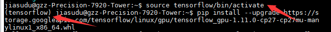
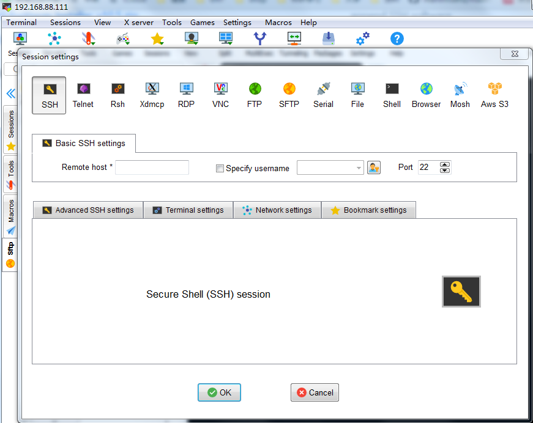
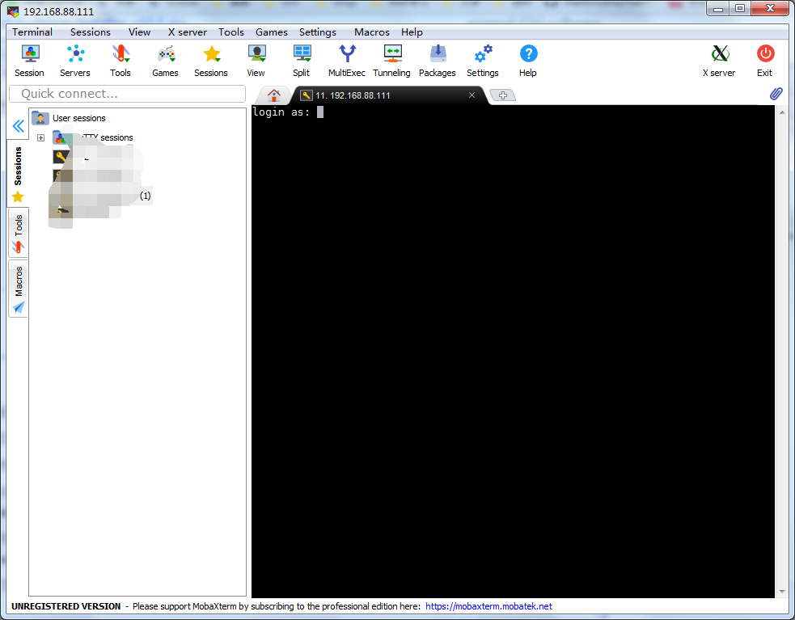
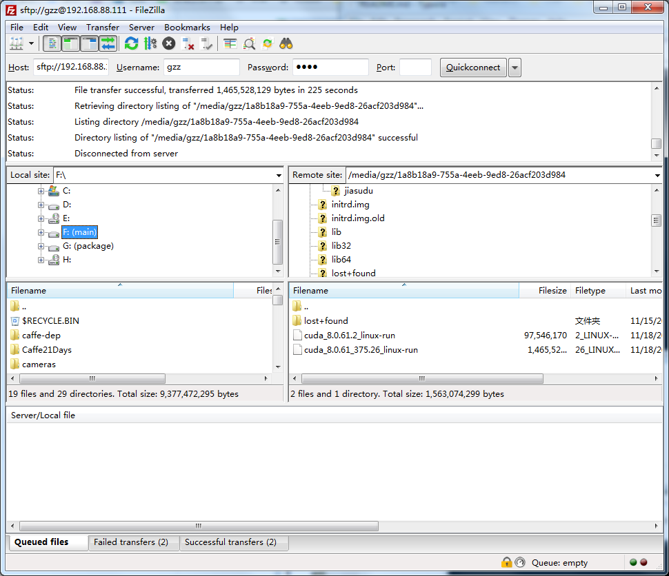
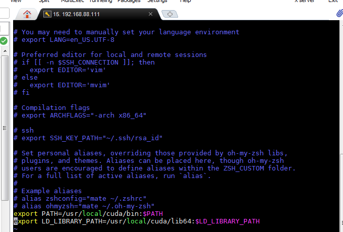

## 自主机器人与视觉智能团队工作站使用说明

关于Caffe、Cuda、Matlab在ubuntu下的安装使用说明，可以参考我[这篇简书](https://www.jianshu.com/p/9a49ac119509)。

关于Ubuntu下的基本命令使用说明，可以参考我[这篇简书](https://www.jianshu.com/p/9a49ac119509)。

请大家使用工作站上一定要**严格遵循以下几条规则**，不然会产生各种使用问题。

1. 在校外使用，需先连学校VPN。
2. 为了避免各自环境变量之前的冲突，建议只是用自己的账号通过MobaXterm等支持SSH协议的软件登录工作站，MobaXterm已经上传至此仓库。
3. 传输文件尽量传输到/media/hdd，可以通过MobaXterm或者[Filezilla](https://filezilla-project.org/)等支持sftp协议的软件进行传输。
4. 由于学校IP无法固定，IP可能被不定期更新，可以在群里咨询最新IP。
5. 尽量不要更新系统和系统中的软件：不要将系统更新为Ubuntu 18.04，尽量不要使用apt-get install(apt install)方式更新系统软件，有需要安装软件的时候尽量使用源码安装方式在自己的工作空间中，安装目录如：/home/**your_name**/local_install，具体安装方法可以参考我[这篇简书](https://www.jianshu.com/p/9a49ac119509)。
6. 请不要更改系统中的环境变量，环境变量都设置在自己的目录下。设置目录如：/home/**your_name**/.zshrc(~/.zshrc)，具体设置方法可以参考我[这篇简书](https://www.jianshu.com/p/9a49ac119509)。
7. 由于系统盘SSD仅有256GB，而HDD有2T。如有大文件等（如几G的数据集）需要存储，请放在/media/hdd目录下，此目录已挂载HDD。
8. 如有对以上问题不清楚或者有更好的使用建议，可以随时联系我。

#### TensorFlow使用方法

​	查看[教程](http://www.tensorfly.cn/tfdoc/get_started/os_setup.html#virtualenv_install)，选择基于VirtualEnv的方法进行安装。

**进入TensoFlow环境**

```bash
source tensorflow/bin/activate
```

**退出TensorFlow环境**

```
deactivate
#命令提示显示原样
```

当进入VirtualEnv时，命令行前显示为(tensorflow)时成功进入，



当退出VirtualEnv时，命令行前的(tensorflow)取消

#### MobaXterm使用方法

​	通过建立新会话，在Remote host处输入IP，登录后输入用户名和密码进行连接即可。

<div align="center"></div>


#### **Filezilla传输文件**

在Host处输入**sftp**://ip，Username输入用户名，Password输入密码。

<div align="center"></div>


#### **~/.zshrc本地环境变量文件**

<div align="center"></div>